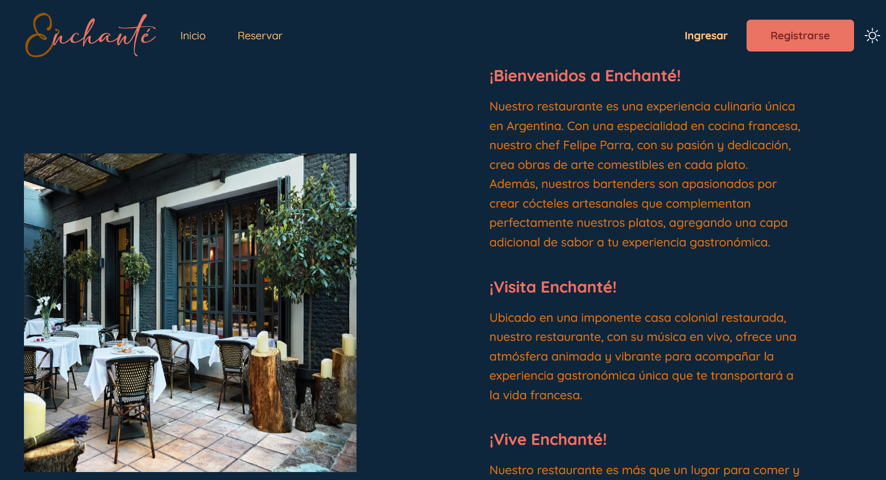
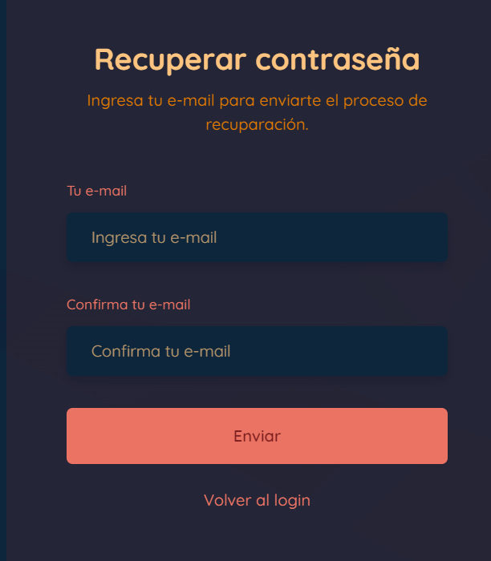

 
<h1 style="text-align:center;"># Front End - Proyecto Integrador 2</h1>

Enchanté 

## Sprint 1

En el apartado de frontend desarrollamos la presentación para el usuario de la siguiente manera: 

### **Issue #1: Implementar template general responsive**

En el desarrollo de este sprint el grupo encargado de desarrollar se centró en el diseño responsive en celular,tablet y pc, para ello se crea la siguiente secuencia:   

Primeros pasos con la aplicación Create React  
Este proyecto se inició con Create React App .

Guiones disponibles  
En el directorio del proyecto, puede ejecutar: 
npm run dev

Ejecuta la aplicación en el modo de desarrollo.  
Abra http://localhost:3000 para verlo en su navegador. 
La página se volverá a cargar cuando realice cambios. 

Documentación: 
https://es.legacy.reactjs.org/docs/getting-started.html 

Se agregaron dependencias como:  

Next.js 
Instalación manual 
Para crear manualmente una nueva aplicación Next.js, instale los paquetes necesarios: 
npm install next@latest react@latest react-dom@latest 
Paquete.json 
{ 
  "scripts": { 
    "dev": "next dev", 
    "build": "next build", 
    "start": "next start", 
    "lint": "next lint" 
  } 
} 
 
Documentación: 
https://nextjs.org/docs/getting-started/installation 

TailwindCss 
Instalación manual 
Para crear manualmente una nueva aplicación TailwindCss, instale los paquetes necesarios: 
npm install -D tailwindcss 
npx tailwindcss init 
Configura tus rutas de plantilla  
Agregue las rutas a todos sus archivos de plantilla en su tailwind.config.jsarchivo. 
/** @type {import('tailwindcss').Config} */ 
module.exports = { 
  content: ["./src/**/*.{html,js}"], 
  theme: { 
    extend: {}, 
  }, 
  plugins: [], 
} 

Documentación : 
https://tailwindcss.com/docs/installation 

Node.js 
Instalación Automática  
Documentación: 
https://nodejs.org/es/docs 

Se crea la página de inicio  
 

### **Issue #5: Implementar el template de Registro**

Se crea el formulario de registro 
 

### **Issue #10: Implementar el template de Reserva**

Se crea la página de reserva  
 

### **Issue #15: **Modo oscuro**

Como funcionalidad extra se le agrega la posibilidad al usuario de visualizar la página en modo oscuro o en modo normal, 
con un botón de luna en la parte superior derecha de la pantalla.  
 

### **Issue #16: **Implementar el template de Login**

Se crea el inicio de sesión  
 

## Sprint 2

### **Issue #17: **Añadir nuevos elementos al Footer**

Se agregan el apartado de nosotros, menú el cual se puede visualizar en otra página, informacion de contacto, horario del restaurante  
  

### **Issue #25: **Implementar la integración con la API de Reservas**

Se hacae la integración para el renderizar el contenido de las reservas.   

### **Issue #26: **Implementar la integración con la API de Productos**

Se hacae la integración para el renderizar el contenido de los productos.  

### **Issue #28: **Implementar la integración con la API de Usuarios**

Se hacae la integración para el renderizar el perfil de usuarios.  

### **Issue #29: **Implementar el template de "Mi Perfil"**

El perfil del usuario se implementa con los datos personales y la fotografia generica  

  

### **Issue #38: **Agregar página "Nosotros"**

En el footer se agrega el enlace para la página nosotros

  

### **Issue #39: **Agregar botón "Menú" en el Footer**

En el footer se agrega el enlace para una siguiente página con el menú en pdf para visualaizar o descargar si asi lo desea el usuario  

  

## Sprint 3

### **Issue #41: **Crear template HTML tipo email para la recuperación de contraseña**

Con el fin de proporcionar a los usuarios una experiencia coherente y profesional durante el proceso de recuperación de contraseña, es necesario crear un template HTML para los correos electrónicos de recuperación de contraseña. Este template debe ser diseñado tanto para ser visualmente atractivo como para brindar las instrucciones necesarias para que los usuarios puedan restablecer su contraseña de manera segura. 

### **Issue #42: **Crear modal para la función "¿Olvidaste tu contraseña?" en la página de inicio de sesión**

El modal será la ventana emergente que se mostrará cuando los usuarios hagan clic en la opción "¿Olvidaste tu contraseña?". 

 

### **Issue #43: **Conectar modal "¿Olvidaste tu contraseña?" con la API de Usuarios**

Implementar la lógica necesaria para que al ingresar una dirección de correo electrónico y hacer clic en el botón de envío, se inicie el proceso de recuperación de contraseña en la API de Usuarios. 

### **Issue #44: **Crear formulario de restablecimiento de contraseña**

Este formulario permitirá a los usuarios ingresar y confirmar su nueva contraseña después de haber iniciado el proceso de recuperación.  

### **Issue #45: **Conectar formulario de restablecimiento de contraseña con la API de Usuarios**

Implementar la lógica necesaria para enviar los datos del formulario a la API, incluyendo la nueva contraseña y cualquier token de seguridad asociado.  

### **Issue #47: **Cargar datos del usuario en la página de "Mi Perfil"**

### **Issue #54: **Agregar sección tipo Dashboard a la página de "Mi Perfil"**

## Sprint 4

### **Issue #64: **Agregar funcionalidad al botón "Editar mis datos"**
### **Issue #65: **Agregar sección de "Reporte" para usuario Administrador**
### **Issue #66: **Agregar funcionalidad al botón "Exportar"**
### **Issue #74: **Implementar página de "Términos y condiciones"**
### **Issue #75: **Implementar página de "Política de Privacidad"**

### **Issue #: ****

