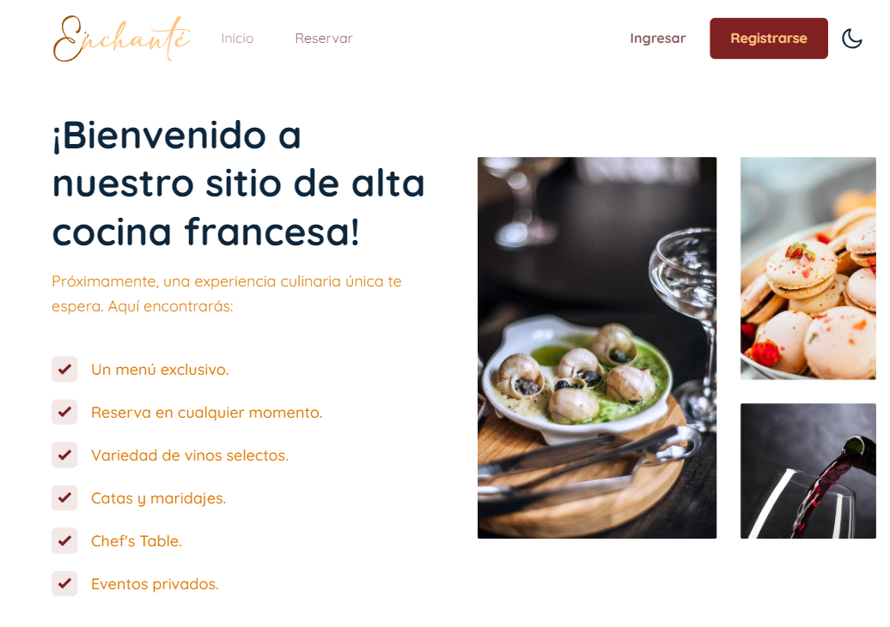
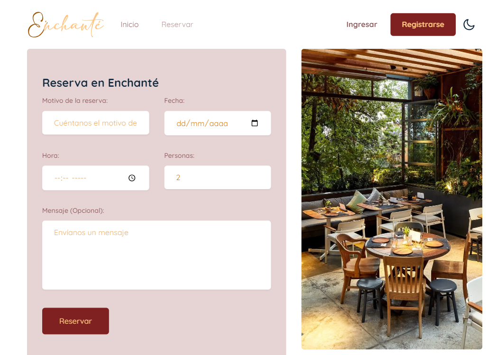
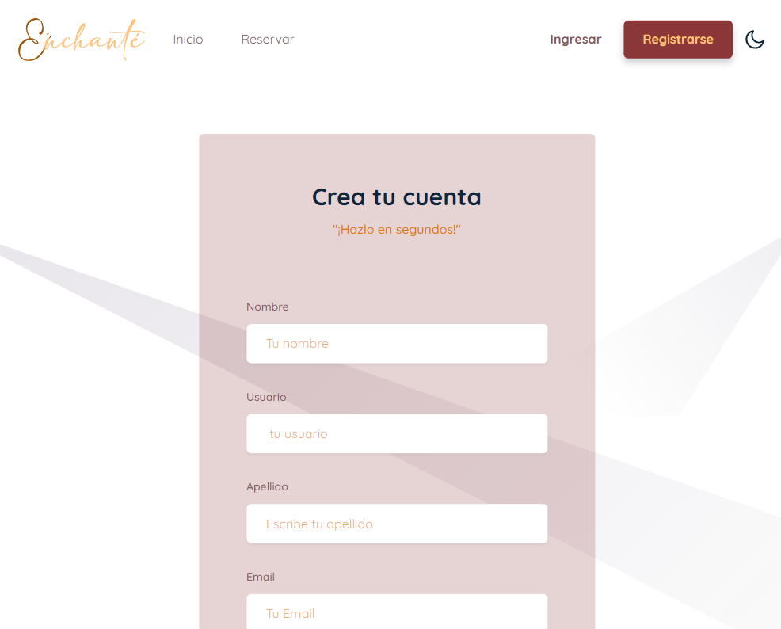
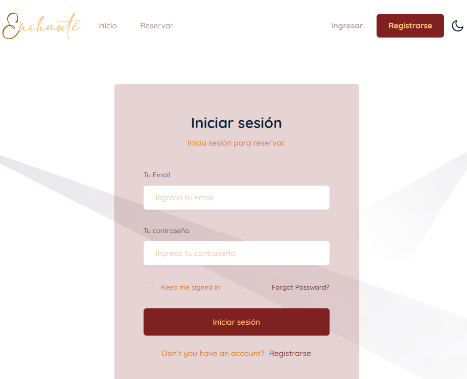
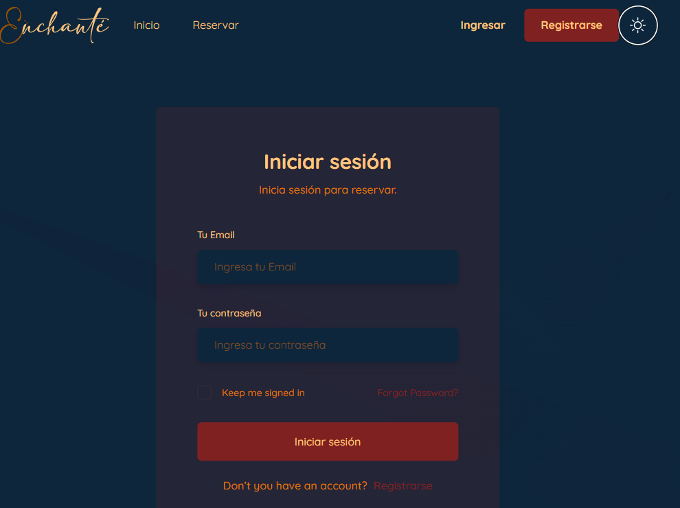

# Equipo 02

Primeros pasos con la aplicación Create React  
Este proyecto se inició con Create React App .

Guiones disponibles  
En el directorio del proyecto, puede ejecutar: 
npm run dev

Ejecuta la aplicación en el modo de desarrollo.  
Abra http://localhost:3000 para verlo en su navegador. 
La página se volverá a cargar cuando realice cambios. 

Documentación: 
https://es.legacy.reactjs.org/docs/getting-started.html  

Se agregaron dependencias como:  

Next.js 
Instalación manual 
Para crear manualmente una nueva aplicación Next.js, instale los paquetes necesarios: 
npm install next@latest react@latest react-dom@latest 
Paquete.json 
{ 
  "scripts": { 
    "dev": "next dev", 
    "build": "next build", 
    "start": "next start", 
    "lint": "next lint" 
  } 
} 
 
Documentación: 
https://nextjs.org/docs/getting-started/installation  

TailwindCss 
Instalación manual 
Para crear manualmente una nueva aplicación TailwindCss, instale los paquetes necesarios: 
npm install -D tailwindcss 
npx tailwindcss init 
  
Configura tus rutas de plantilla  
Agregue las rutas a todos sus archivos de plantilla en su tailwind.config.jsarchivo. 
/** @type {import('tailwindcss').Config} */ 
module.exports = { 
  content: ["./src/**/*.{html,js}"], 
  theme: { 
    extend: {}, 
  }, 
  plugins: [], 
} 
 
Documentación : 
https://tailwindcss.com/docs/installation 
  
Node.js 
Instalación Automática  
Documentación: 
https://nodejs.org/es/docs 
   

Enchanté  

Desarrollo Frontend:  
En el apartado de frontend desarrollamos la presetnación para el usuario de la siguiente manera:   

SPRINT 1: 
En el desarrollo de este sprint el grupo encargado de desarrollar se centró en el diseño responsive en celular, 
tablet y pc, para ello se crea la siguiente secuencia:    

Se crea la página de inicio  
  
Se crea la página de reserva  
 
Se crea el formulario de registro 
 
Se crea el inicio de sesión  
 
 
Como funcionalidad extra se le agrega la posibilidad al usuario de visualizar la página en modo oscuro o en modo normal, 
con un botón de luna en la parte superior derecha de la pantalla.  
 
